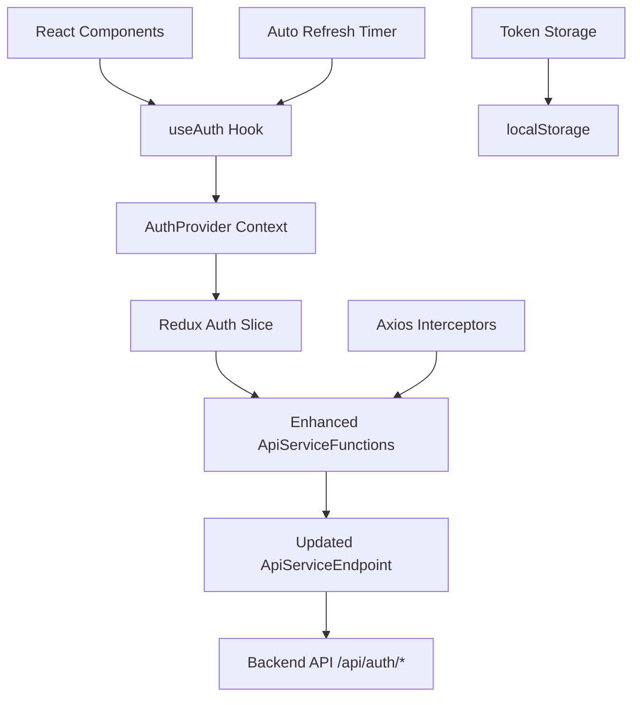
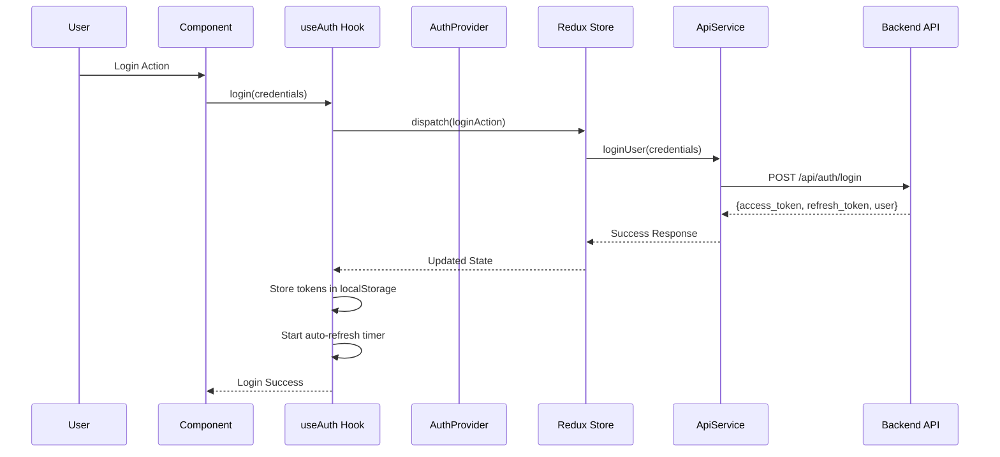
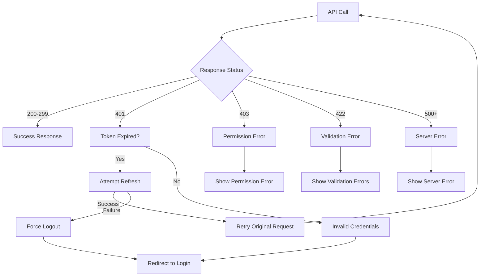
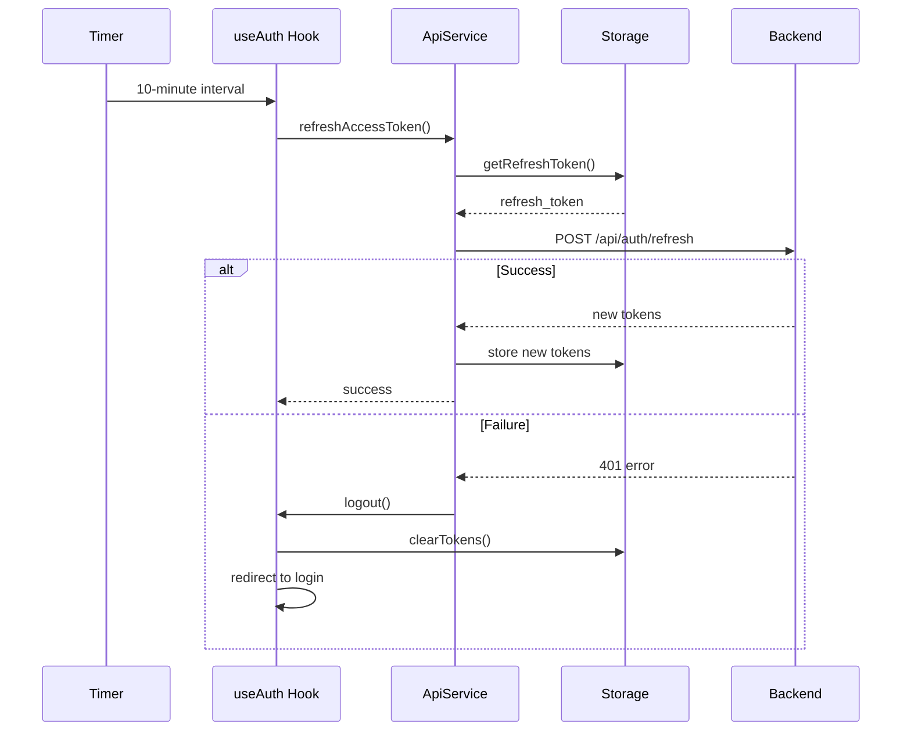

# Authentication System Design Document

## Overview

This design document outlines the enhancement of the existing authentication system for the AS2 Pharmacovigilance Portal. The system will integrate with the OpenAPI specification endpoints, improve the current API service layer, and provide comprehensive authentication state management with automatic token refresh capabilities.

The design builds upon the existing Redux-based authentication slice, React context, and API service functions while ensuring consistency with the OpenAPI specification and implementing modern authentication best practices.

## Architecture

### High-Level Architecture



### Component Interaction Flow



## Components and Interfaces

### 1. Enhanced ApiServiceEndpoint

**Purpose:** Centralized endpoint definitions matching OpenAPI specification

**Interface:**
```javascript
const ApiEndPoints = {
  // Base URL configuration
  BASE_URL: process.env.NEXT_PUBLIC_API_URL || 'http://localhost:8000',
  
  // Authentication endpoints
  AUTH: {
    LOGIN: '/api/auth/login',
    REGISTER: '/api/auth/register', 
    LOGOUT: '/api/auth/logout',
    REFRESH_TOKEN: '/api/auth/refresh',
    USER_ME: '/api/auth/me'
  },
  
  // Other existing endpoints...
}
```

**Key Features:**
- Consistent naming conventions
- Direct mapping to OpenAPI specification
- Environment-based URL configuration
- Hierarchical organization by feature

### 2. Enhanced ApiServiceFunctions

**Purpose:** HTTP client wrapper with authentication-specific methods

**Core Methods:**
```javascript
const ApiService = {
  // Token management
  setToken(token),
  getAccessToken(),
  setRefreshToken(token), 
  getRefreshToken(),
  clearTokens(),
  
  // Authentication API methods
  loginUser(credentials),
  registerUser(userData),
  logoutUser(),
  getCurrentUser(),
  refreshAccessToken(),
  
  // Enhanced HTTP methods with auto-retry
  get(url, options),
  post(url, data, options),
  put(url, data, options),
  delete(url, options)
}
```

**Response Format:**
```javascript
// Success response
{
  data: {...}, // API response data
  error: null
}

// Error response  
{
  data: null,
  error: {
    message: "Error description",
    status: 401,
    code: "UNAUTHORIZED"
  }
}
```

### 3. useAuth Hook

**Purpose:** React hook for authentication state and operations

**Interface:**
```javascript
const useAuth = () => {
  return {
    // State
    user: User | null,
    isAuthenticated: boolean,
    isLoading: boolean,
    error: string | null,
    
    // Methods
    login: (credentials) => Promise<{data, error}>,
    logout: () => Promise<void>,
    register: (userData) => Promise<{data, error}>,
    getCurrentUser: () => Promise<{data, error}>,
    refreshToken: () => Promise<{data, error}>,
    
    // Utilities
    clearError: () => void
  }
}
```

**Key Features:**
- Automatic token refresh every 10-15 minutes
- Persistent session restoration on app load
- Automatic logout on token expiration
- Consistent error handling

### 4. Enhanced AuthProvider

**Purpose:** React context provider for global authentication state

**Context Value:**
```javascript
const AuthContextValue = {
  user: User | null,
  isAuthenticated: boolean,
  isLoading: boolean,
  error: string | null,
  login: Function,
  logout: Function,
  register: Function,
  getCurrentUser: Function,
  refreshToken: Function,
  clearError: Function
}
```

**Provider Features:**
- Wraps application root
- Provides global authentication state
- Handles session persistence
- Manages automatic token refresh

### 5. Enhanced Redux Auth Slice

**Purpose:** Centralized authentication state management

**State Shape:**
```javascript
const authState = {
  user: {
    id: string,
    email: string,
    name: string,
    role: string,
    organization: object
  } | null,
  accessToken: string | null,
  refreshToken: string | null,
  isLoading: boolean,
  error: string | null,
  lastRefresh: number | null
}
```

**Actions:**
- `loginStart()` - Set loading state
- `loginSuccess(payload)` - Store user and tokens
- `loginFailure(error)` - Store error state
- `logout()` - Clear all auth state
- `refreshTokenStart()` - Set refresh loading
- `refreshTokenSuccess(tokens)` - Update tokens
- `refreshTokenFailure()` - Handle refresh failure
- `clearError()` - Clear error state

## Data Models

### User Model
```javascript
interface User {
  id: string
  email: string
  name: string
  role: 'admin' | 'user' | 'viewer'
  organization: {
    id: string
    name: string
    type: string
  }
  isActive: boolean
  lastLogin: string
  createdAt: string
  updatedAt: string
}
```

### Token Response Model
```javascript
interface TokenResponse {
  access_token: string
  refresh_token: string
  token_type: 'bearer'
  expires_in: number
  user: User
}
```

### API Response Models
```javascript
interface ApiSuccessResponse<T> {
  data: T
  error: null
}

interface ApiErrorResponse {
  data: null
  error: {
    message: string
    status: number
    code: string
    details?: any
  }
}
```

## Error Handling

### Error Categories

1. **Network Errors**
   - Connection timeouts
   - Network unavailable
   - Server unreachable

2. **Authentication Errors**
   - Invalid credentials (401)
   - Token expired (401)
   - Insufficient permissions (403)

3. **Validation Errors**
   - Invalid input format (422)
   - Missing required fields (400)

4. **Server Errors**
   - Internal server error (500)
   - Service unavailable (503)

### Error Handling Strategy



### Automatic Token Refresh Flow



## Testing Strategy

### Unit Testing

1. **ApiServiceFunctions Tests**
   - Test each authentication method
   - Mock axios responses
   - Verify error handling
   - Test token management

2. **useAuth Hook Tests**
   - Test authentication state changes
   - Mock API calls
   - Test automatic refresh logic
   - Test session persistence

3. **Redux Slice Tests**
   - Test action creators
   - Test reducers
   - Test state transitions
   - Test error states

### Integration Testing

1. **Authentication Flow Tests**
   - End-to-end login flow
   - Registration flow
   - Logout flow
   - Token refresh flow

2. **Context Provider Tests**
   - Test provider initialization
   - Test state propagation
   - Test session restoration

### Error Scenario Testing

1. **Network Failure Tests**
   - Test offline scenarios
   - Test timeout handling
   - Test retry mechanisms

2. **Token Expiration Tests**
   - Test automatic refresh
   - Test refresh failure
   - Test forced logout

## Security Considerations

### Token Storage
- Use localStorage for token persistence
- Clear tokens on logout
- Implement token rotation
- Set appropriate token expiration

### API Security
- Always use HTTPS in production
- Include CSRF protection
- Implement rate limiting
- Validate all inputs

### Session Management
- Automatic session timeout
- Secure token refresh
- Proper logout cleanup
- Session restoration validation

## Implementation Notes

### Migration Strategy
1. Update ApiServiceEndpoint with new endpoints
2. Enhance ApiServiceFunctions with authentication methods
3. Update Redux auth slice with new actions
4. Enhance useAuth hook with new functionality
5. Update AuthProvider with session management
6. Test integration with existing components

### Backward Compatibility
- Maintain existing API method signatures where possible
- Provide migration path for existing token storage
- Ensure existing components continue to work
- Gradual rollout of new features

### Performance Considerations
- Minimize re-renders with proper memoization
- Efficient token refresh scheduling
- Lazy loading of user data
- Optimized storage operations